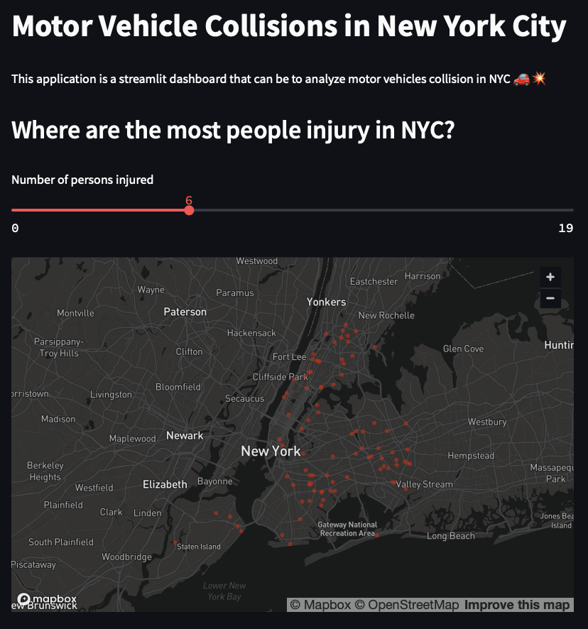
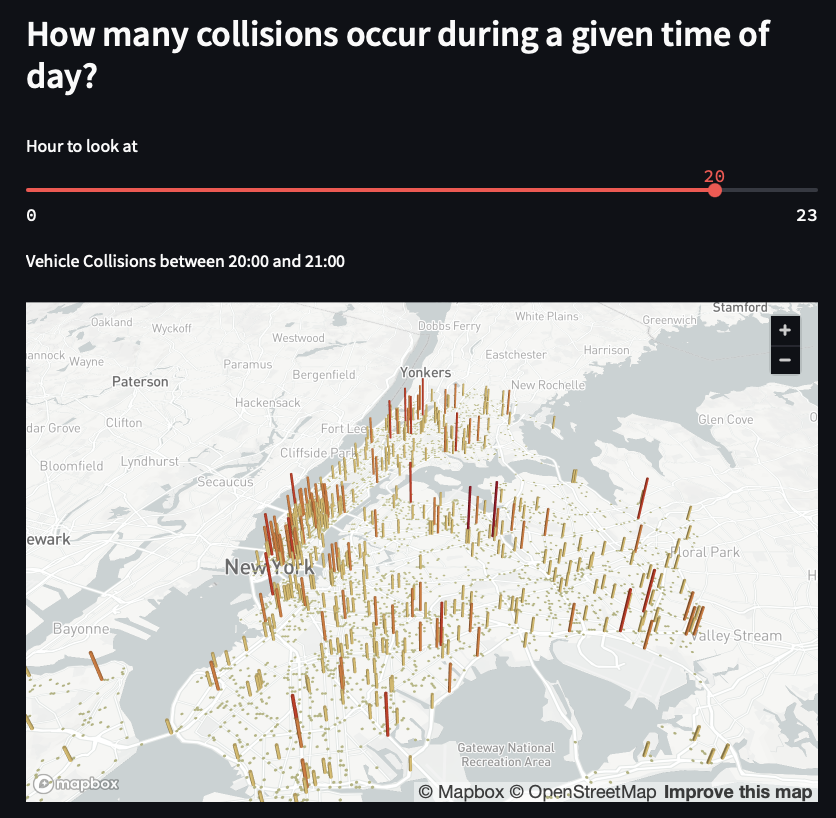
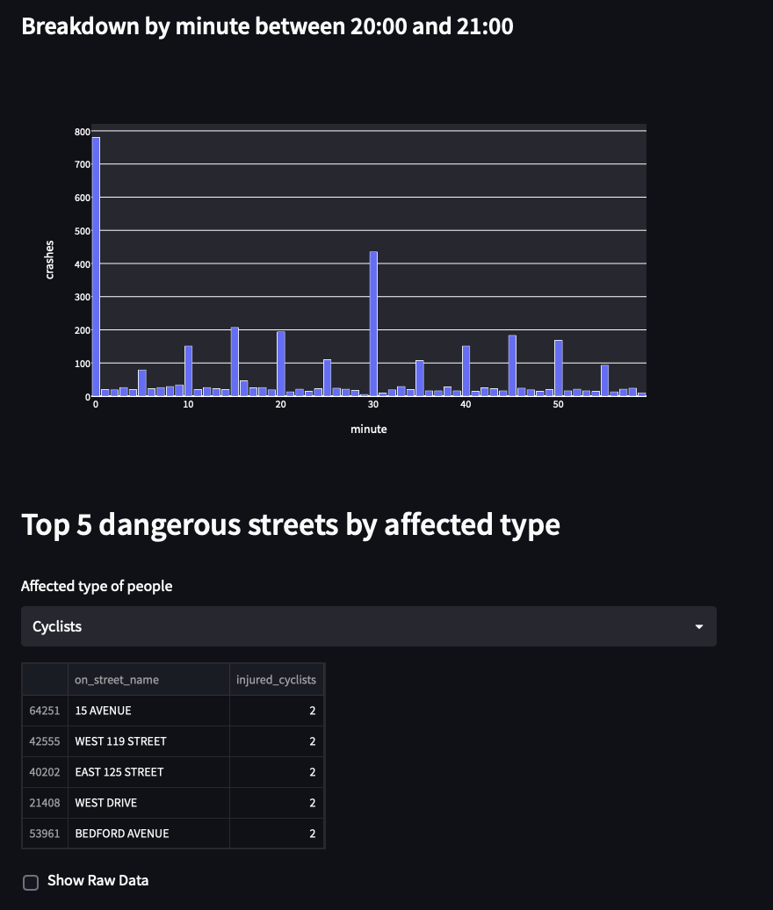

# Motor Vehicle Collisions in New York City
The following project is a Streamlit dashboard application that allows users to analyze motor vehicle collisions in New York City. It uses the Streamlit library to create an interactive web-based interface where users can input different parameters to explore the data and visualize the results.

The data used in this application is a CSV file containing information about motor vehicle collisions in New York City. The data is loaded into a Pandas dataframe using the 'pd.read_csv' function and is pre-processed by cleaning and renaming columns. The data is also parsed to include a datetime column by merging the 'CRASH_DATE' and 'CRASH_TIME' columns.

The application has several features that allow users to explore the data. The first feature allows users to see the location of collisions where a certain number of people were injured. This is done using a slider that the user can adjust to change the number of injured people and a map that shows the locations of collisions where the number of injured people is greater than or equal to the user's input.

The second feature allows users to see how many collisions occurred during a specific time of day. This is done using a slider that the user can adjust to change the hour they want to see data for and a hexagon map that shows the locations of collisions that occurred during the selected hour. The map also shows a breakdown of collisions by minute within the selected hour.

The final feature allows users to see the top 5 most dangerous streets by the type of person affected. This is done using a drop-down menu where the user can select the type of person (Pedestrians, Cyclists, or Motorists) and a table that shows the top 5 streets with the most collisions involving that type of person.

## Conclusion
Overall, this application allows users to explore and visualize motor vehicle collision data in New York City and provides insights into the location, timing, and types of people affected by these collisions.